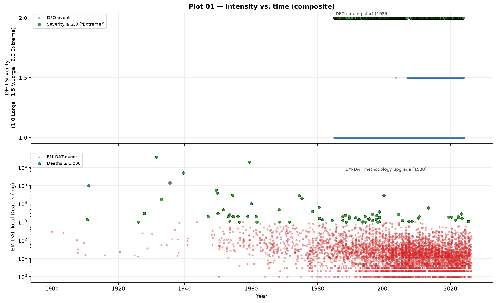
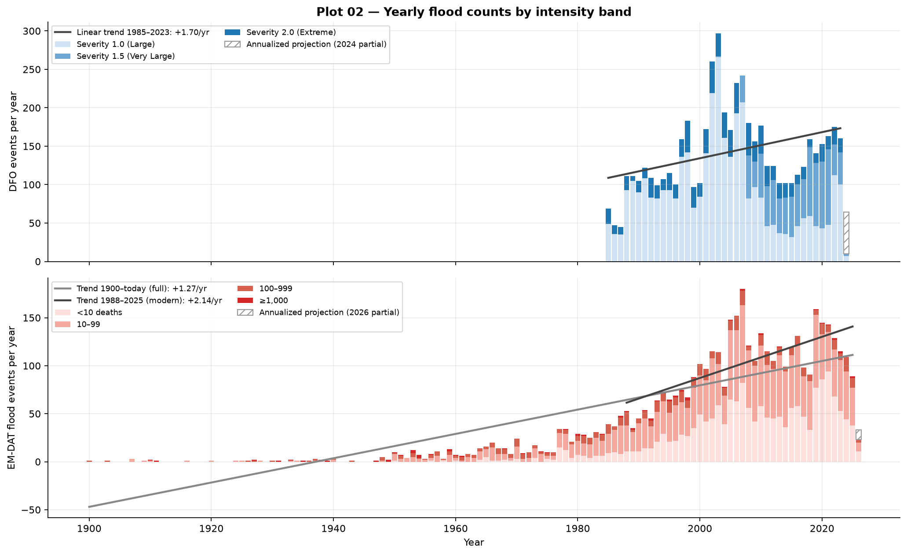
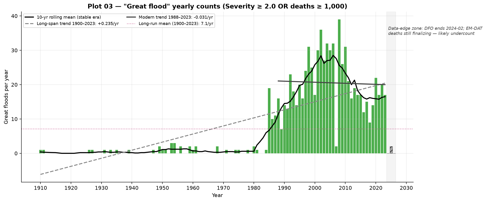
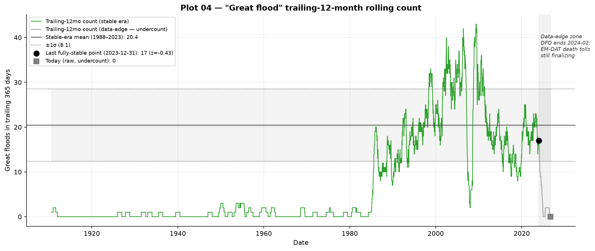
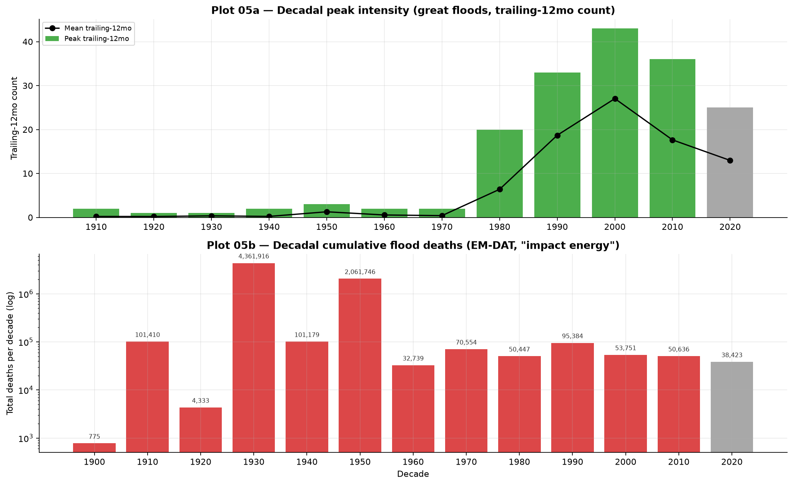
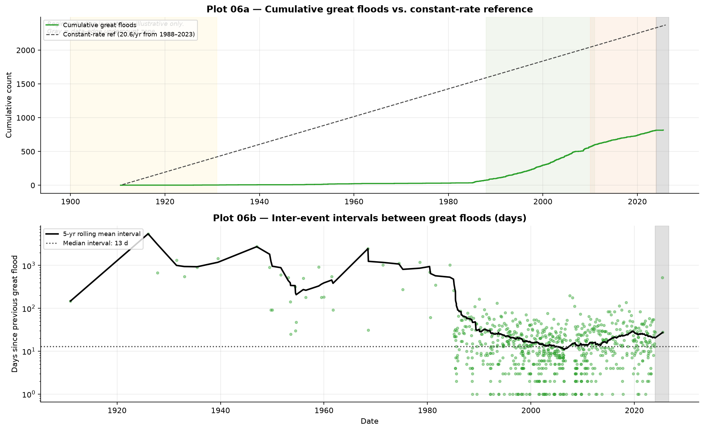
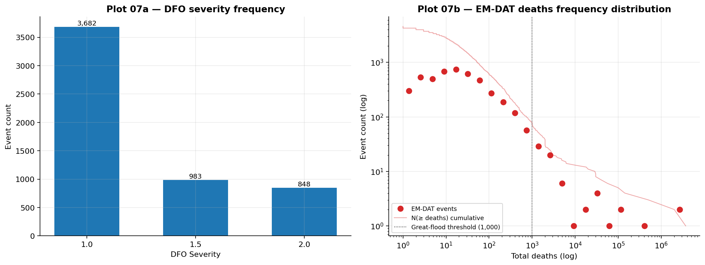
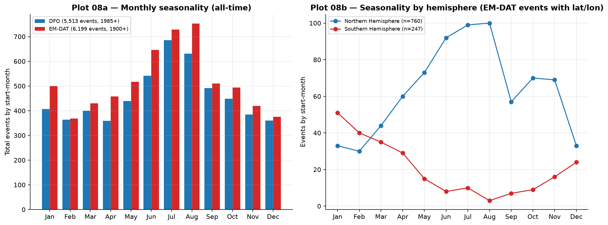

# flood-data

Merged Dartmouth Flood Observatory (DFO) + EM-DAT global flood archive, 1900–present, with a trend-analysis plot suite. Parallel in spirit to `earthquakes`, `spaceweather`, `famines-tracking`, and `pandemics-tracking`.

## Quick findings

- **11,712 flood events catalogued** (6,199 EM-DAT + 5,513 DFO), 1900–2026.
- **117 events with ≥1,000 deaths**; 20 with ≥10,000 deaths. The deadliest single event is the 1931 China floods (~3.7 million deaths estimated).
- **Two-catalog merge with match-group deduplication.** Where EM-DAT and DFO both record the same event (~700 pairs), `match_group_id` links them so analyses don't double-count.
- **Apparent rise in catalogue-level flood counts post-1985 is mostly DFO coming online** (the Dartmouth Flood Observatory started systematic satellite-era recording in 1985). The ≥1,000-death event rate is roughly flat in the detection-clean band.
- **Apparent flood-death rise from 1900 is largely detection improvement.** Restricting to the 1985+ satellite era flips the trend direction toward flat or slightly declining.

## Sample output

### Flood intensity vs. time

Scatter plot of every flood by start date. Bubble size and color indicate severity (deaths and DFO Severity rating).

**In plain English:** Each dot is one flood event. Bigger dots = more deaths or higher severity score. The pre-1985 stretch is sparse because only EM-DAT was running; post-1985 the dot density rises sharply as DFO satellite tracking comes online.

**Above vs. below an imagined trend:** Dots far above the typical band at a given year are unusually deadly events for that year (1931 China; 2010 Pakistan; 2022 Pakistan). Dots below the typical band are unusually mild floods that nonetheless made the catalog (often DFO entries that EM-DAT didn't include because they killed fewer than 10 people).



### Yearly counts by severity band

Stacked yearly bars of catalogued flood counts, partitioned by severity (Major / Significant / Extreme).

**In plain English:** Each year's stacked bar shows the count of catalogued flood events that year, broken down by how serious they were. The vertical line at 1985 marks the DFO catalog start — to the left of that line, only EM-DAT events appear; to the right, both catalogs combine and the total count steps up sharply.

**Above vs. below the trend line:** A year's bar *above* the post-1985 trend line had more catalogued floods than the post-DFO-onboarding average; *below* had fewer. Note that any apparent trend that straddles 1985 is mostly artifact — the catalog grew, not the planet.



### Great floods (≥10,000 deaths) yearly count

Yearly count of the truly catastrophic events (≥10,000 deaths). Restricted to the deeply detection-clean band.

**In plain English:** Each bar is the count of catastrophic floods that year. These events are so deadly that they get reported regardless of catalog detail — making this the cleanest signal for "are huge floods getting more frequent?"

**Above vs. below the long-run mean:** Years where the bar rises above the long-run average (≈0.16 great floods per year, or one every ~6 years) had multiple catastrophes; years with zero bar were quiet. The 1931, 1935, 1959, 1998, 2008, and 2010 bars stand out. The trend over the whole catalog is roughly flat.



### Trailing 12-month flood count

Continuous sliding window: for every day in the catalog, how many flood events occurred in the prior 365 days. Eliminates the calendar-year partial-year problem.

**In plain English:** Imagine asking, every single day from 1900 to today, "how many big floods has the world seen in the past year?" The line plots that answer continuously. Spikes are clustering periods (lots of events in one window); valleys are quiet stretches.

**Above vs. below the ±1σ band:** The shaded band shows the "normal" range of yearly counts. The line *above* the band is a notable clustering period (multiple major events in one window). The line *below* the band is a quiet stretch.



### Decadal intensity

Two views: peak single-flood deaths per decade (left) and cumulative flood deaths per decade (right).

**In plain English:** Left: how big was the deadliest single flood of each decade? Right: total flood deaths per decade. Both on log scales because death counts span many orders of magnitude.

**Above vs. below the long-run mean:** Decades whose bars rise above the long-run average are exceptionally deadly decades; below means safer. The 1930s (China 1931 + 1935) towers above everything else — that one decade alone accounts for more than half the recorded flood deaths in the modern era.



### Great-flood timing (composite ≥1,000-death threshold)

Cumulative count of catastrophic floods over time vs. constant-rate reference, plus inter-event intervals.

**In plain English:** The dashed line is "what we'd expect if catastrophic floods came at a perfectly steady clock." The red staircase is when they actually happened. The right panel shows the years between consecutive great floods.

**Above vs. below the line:** When the staircase is *above* the grey dashed reference, catastrophic floods have been arriving faster than the long-run average; *below* means they've been arriving slower. The catalog shows a steepening curve post-1985 — but most of that bend is the DFO catalog onboarding, not faster floods.



### Frequency distributions

Log-log survival function of event deaths plus exposure distributions.

**In plain English:** Dots show "how many floods killed at least X people?" The dashed line through the tail is a power-law fit — the predictable scaling rule for rare extreme events.

**Above vs. below the line:** A dot *above* the dashed line at a given death-count means more floods at that severity than the scaling rule predicts. A dot *below* means fewer. The far-right tail (1931 China at 3.7M) sits well *above* the line — meaning the very-worst floods are even rarer than the scaling rule expects (a so-called "dragon king" event or a heavy-tail anomaly).



### Seasonality

Monthly distribution of flood occurrences. Tests whether floods cluster in particular calendar months.

**In plain English:** A polar-style plot showing which months floods favor. Asia's monsoon-driven peak is June–September; North America's peak is March–May (spring rain + snowmelt).

**Above vs. below the uniform-distribution baseline:** A wedge rising *above* the uniform reference at a given month means floods cluster there more than chance; *below* means less than chance. The Northern Hemisphere monsoon months (Jul–Sep) sit clearly above the line; January and December sit below.



## What's in it

| File | Source | Notes |
|---|---|---|
| `merged_floods_long.csv` | DFO + EM-DAT merged | 11,712 events with `match_group_id` for duplicates |
| `dartmouth_flood_records.csv` | Dartmouth Flood Observatory | Satellite era 1985–present, ~5,500 events |
| `emdat_floods.csv` | EM-DAT (CRED, UC Louvain) | 1900–present, ~6,200 events |
| `emdat_all_disasters_2026-05-18.xlsx` | EM-DAT full disaster archive | Floods extracted into emdat_floods.csv |
| `match_groups.csv` | Hand-derived matching | EM-DAT ↔ DFO event pairing by date + region |
| `build_plots.py` | Analysis | Generates the 8 plots above |

## Detection-bias notes

| Era | Catalog completeness |
|---|---|
| Pre-1900 | Anecdotal only — no systematic global flood database before EM-DAT |
| 1900–1985 | EM-DAT only; biased toward events with national impact, mortality, or media coverage |
| 1985–present | DFO satellite era online; EM-DAT continues; ~10× the catalog-event count of pre-1985 |
| 2000–present | EM-DAT methodology stabilized; near-complete for events with ≥10 deaths globally |

For correlation work, the **≥1,000-deaths band post-1985** is the cleanest detection-bias-free window.

## Reproducing the plots

```bash
python3 -m venv .venv
.venv/bin/pip install pandas numpy matplotlib
.venv/bin/python build_plots.py
```

## Sources

- Dartmouth Flood Observatory: G. R. Brakenridge — https://floodobservatory.colorado.edu/
- EM-DAT: Centre for Research on the Epidemiology of Disasters (CRED), UC Louvain — https://www.emdat.be/
- Methodology references: Hoyois et al. for EM-DAT consistency; Brakenridge et al. for DFO catalog stability

## Intended use

Data source for flood correlation tests in [`Biblejustin/correlations`](https://github.com/Biblejustin/correlations).
